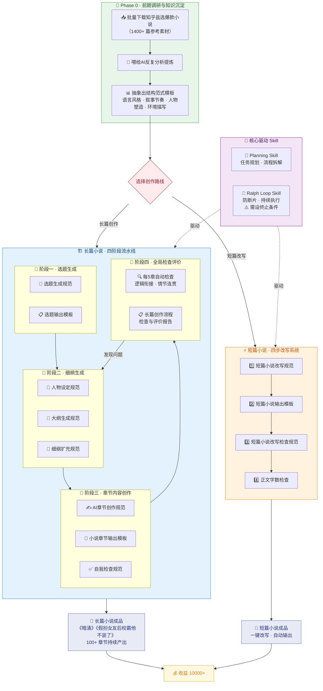
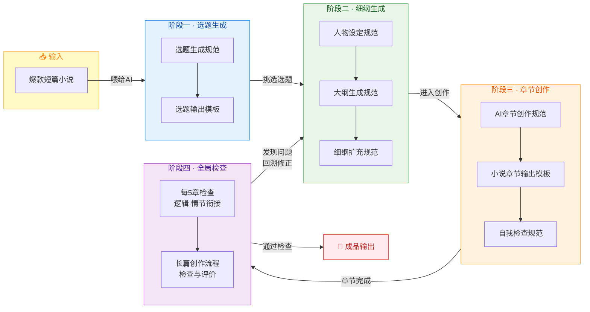
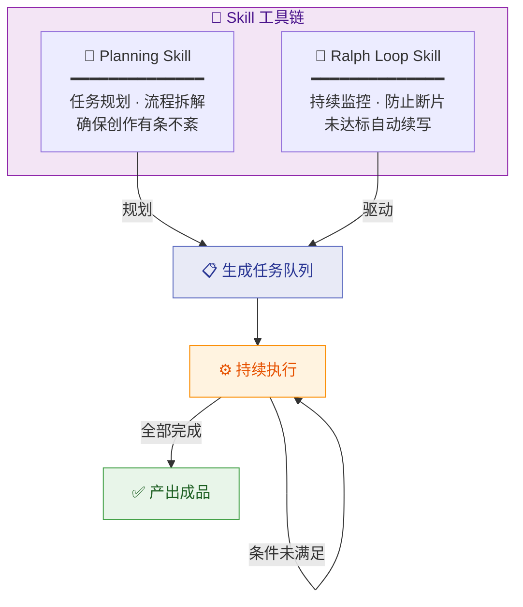

# 🗺️ AI小说创作系统 · 完整流程图

---

## 全景流程

```mermaid
flowchart TB
    subgraph Phase0["🧠 Phase 0 · 前期调研与知识沉淀"]
        A1["📥 批量下载知乎盐选爆款小说<br/>（1400+ 篇参考素材）"]
        A2["🤖 喂给AI反复分析提炼"]
        A3["📊 抽象出结构范式模板<br/>语言风格 · 叙事节奏 · 人物塑造 · 环境描写"]

        A1 --> A2 --> A3
    end

    A3 --> B{选择创作路线}

    subgraph Long["🏗️ 长篇小说 · 四阶段流水线"]
        direction TB

        subgraph L1["📌 阶段一 · 选题生成"]
            direction LR
            L1A["📝 选题生成规范"]
            L1B["📋 选题输出模板"]
        end

        subgraph L2["📌 阶段二 · 细纲生成"]
            direction LR
            L2A["👤 人物设定规范"]
            L2B["📐 大纲生成规范"]
            L2C["🔄 细纲扩充规范"]
        end

        subgraph L3["📌 阶段三 · 章节内容创作"]
            direction LR
            L3A["✍️ AI章节创作规范"]
            L3B["📄 小说章节输出模板"]
            L3C["✅ 自我检查规范"]
        end

        subgraph L4["📌 阶段四 · 全局检查评价"]
            direction LR
            L4A["🔍 每5章自动检查<br/>逻辑衔接 · 情节连贯"]
            L4B["📋 长篇创作流程<br/>检查与评价报告"]
        end

        L1 --> L2 --> L3 --> L4
        L4 -->|发现问题| L2
    end

    subgraph Short["⚡ 短篇小说 · 四步改写系统"]
        direction TB

        S1["1️⃣ 短篇小说改写规范"]
        S2["2️⃣ 短篇小说输出模板"]
        S3["3️⃣ 短篇小说改写检查规范"]
        S4["4️⃣ 正文字数检查"]

        S1 --> S2 --> S3 --> S4
    end

    B -->|"长篇创作"| Long
    B -->|"短篇改写"| Short

    subgraph Tools["🔧 核心驱动 Skill"]
        T1["🎯 Planning Skill<br/>任务规划 · 流程拆解"]
        T2["🔄 Ralph Loop Skill<br/>防断片 · 持续执行<br/>⚠️ 需设终止条件"]
    end

    Tools -.->|驱动| Long
    Tools -.->|驱动| Short

    Long --> Output1["📖 长篇小说成品<br/>《暗涌》《假扮女友后校霸他不装了》<br/>100+ 章节持续产出"]
    Short --> Output2["📖 短篇小说成品<br/>一键改写 · 自动输出"]

    Output1 --> Money["💰 收益 10000+"]
    Output2 --> Money

    style Phase0 fill:#e8f5e9,stroke:#43a047,color:#1b5e20
    style Long fill:#e3f2fd,stroke:#1e88e5,color:#0d47a1
    style Short fill:#fff3e0,stroke:#fb8c00,color:#e65100
    style Tools fill:#f3e5f5,stroke:#8e24aa,color:#4a148c
    style Money fill:#fff8e1,stroke:#f9a825,color:#f57f17
    style B fill:#ffebee,stroke:#e53935,color:#b71c1c
    style Output1 fill:#e8eaf6,stroke:#5c6bc0,color:#283593
    style Output2 fill:#e8eaf6,stroke:#5c6bc0,color:#283593
```

---

## 长篇小说 · 详细流程

```mermaid
flowchart LR
    subgraph Input["📥 输入"]
        I1["爆款短篇小说"]
    end

    subgraph S1["阶段一 · 选题生成"]
        direction TB
        R1["选题生成规范"]
        R2["选题输出模板"]
        R1 --> R2
    end

    subgraph S2["阶段二 · 细纲生成"]
        direction TB
        R3["人物设定规范"]
        R4["大纲生成规范"]
        R5["细纲扩充规范"]
        R3 --> R4 --> R5
    end

    subgraph S3["阶段三 · 章节创作"]
        direction TB
        R6["AI章节创作规范"]
        R7["小说章节输出模板"]
        R8["自我检查规范"]
        R6 --> R7 --> R8
    end

    subgraph S4["阶段四 · 全局检查"]
        direction TB
        R9["每5章检查<br/>逻辑·情节衔接"]
        R10["长篇创作流程<br/>检查与评价"]
        R9 --> R10
    end

    I1 -->|"喂给AI"| S1
    S1 -->|"挑选选题"| S2
    S2 -->|"进入创作"| S3
    S3 -->|"章节完成"| S4
    S4 -->|"发现问题<br/>回溯修正"| S2
    S4 -->|"通过检查"| Output["📖 成品输出"]

    style Input fill:#fff9c4,stroke:#f9a825,color:#f57f17
    style S1 fill:#e3f2fd,stroke:#1e88e5,color:#0d47a1
    style S2 fill:#e8f5e9,stroke:#43a047,color:#1b5e20
    style S3 fill:#fff3e0,stroke:#fb8c00,color:#e65100
    style S4 fill:#f3e5f5,stroke:#8e24aa,color:#4a148c
    style Output fill:#ffebee,stroke:#e53935,color:#b71c1c
```

---

## 短篇小说 · 改写流程

```mermaid
flowchart LR
    Input["📥 输入爆款短篇"] --> S1

    subgraph System["⚡ 短篇小说改写系统"]
        direction LR
        S1["① 改写规范"]
        S2["② 输出模板"]
        S3["③ 改写检查规范"]
        S4["④ 正文字数检查"]
    end

    S1 --> S2 --> S3 --> S4
    S4 --> Output["📖 完整短篇小说<br/>自动输出 ✅"]

    style Input fill:#fff9c4,stroke:#f9a825,color:#f57f17
    style System fill:#fff3e0,stroke:#fb8c00,color:#e65100
    style Output fill:#e8f5e9,stroke:#43a047,color:#1b5e20
```

---

## 核心工具链

```mermaid
flowchart TB
    subgraph Core["🔧 Skill 工具链"]
        P["🎯 Planning Skill<br/>━━━━━━━━━━━━━━<br/>任务规划 · 流程拆解<br/>确保创作有条不紊"]
        R["🔄 Ralph Loop Skill<br/>━━━━━━━━━━━━━━<br/>持续监控 · 防止断片<br/>未达标自动续写"]
    end

    P -->|"规划"| Task["📋 生成任务队列"]
    R -->|"驱动"| Task
    Task --> Execute["⚙️ 持续执行"]
    Execute -->|"条件未满足"| Execute
    Execute -->|"全部完成"| Done["✅ 产出成品"]

    style Core fill:#f3e5f5,stroke:#8e24aa,color:#4a148c
    style Task fill:#e8eaf6,stroke:#5c6bc0,color:#283593
    style Execute fill:#fff3e0,stroke:#fb8c00,color:#e65100
    style Done fill:#e8f5e9,stroke:#43a047,color:#1b5e20
```

---

> 💡 **提示**：在 Obsidian 中直接查看此笔记即可渲染流程图。如果显示异常，请确保 `设置 → Markdown → Mermaid` 已开启。
