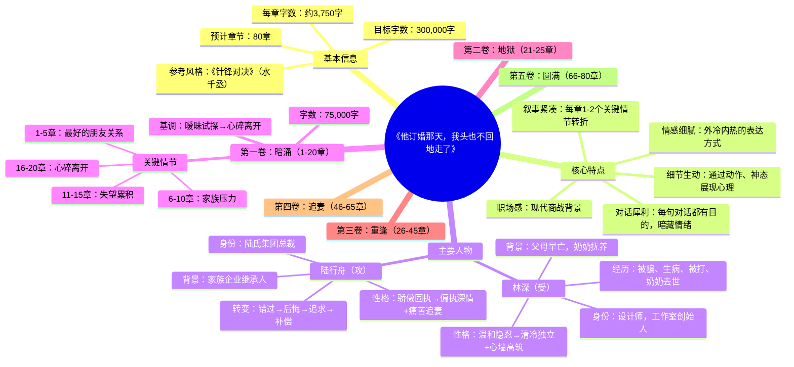
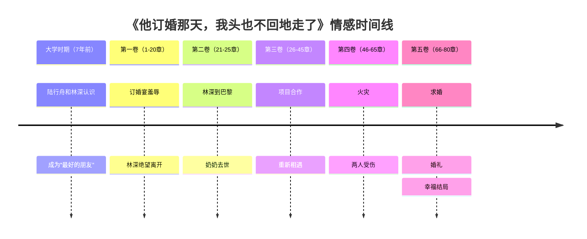

# 《他订婚那天，我头也不回地走了》Mermaid思维导图

## 代码版本（可在支持Mermaid的Markdown编辑器中查看）

## 情感时间线

## 人物关系图、情感曲线

（结构同原版，书名已统一为《他订婚那天，我头也不回地走了》。）

---

*思维导图创建日期：2026年2月14日*
*书名：《他订婚那天，我头也不回地走了》*
*参考风格：《针锋对决》*
*目标字数：30万字*
*预计章节：80章*
