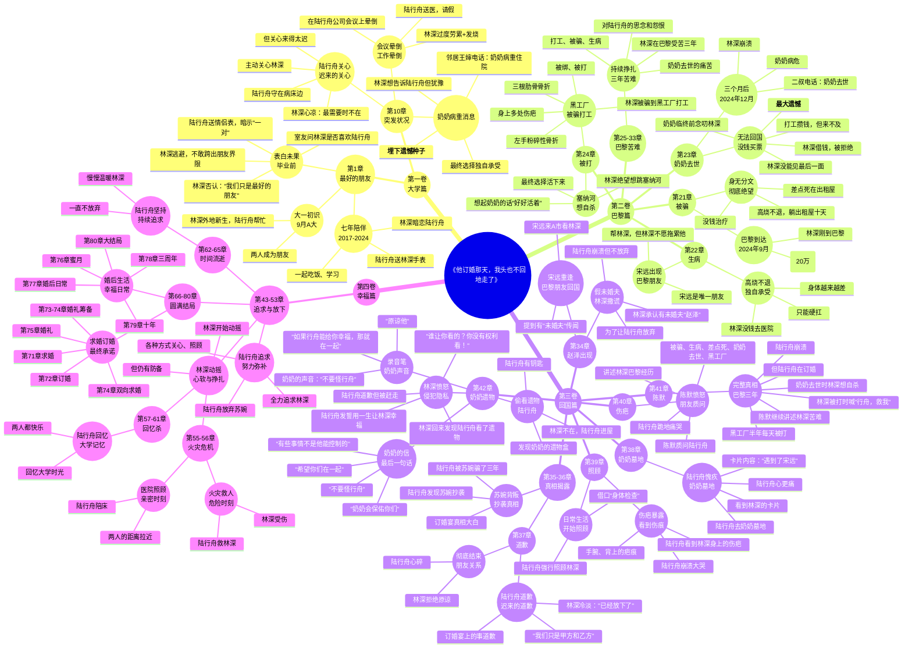

# 《他订婚那天，我头也不回地走了》完整故事情节思维导图

## 📖 故事情节总览

## 🔍 情节重复检查

### ✅ 无重复情节
以下情节**没有重复**，结构合理：

1. **第1章-第9章**：大学友情期，逐步发展
2. **第10章**：突发状况（独立情节，不与第23章重复）
3. **第11-20章**：订婚宴前奏
4. **第21-33章**：巴黎苦难篇（完整情节线）
5. **第34-42章**：回国真相揭露（完整情节线）
6. **第43-80章**：追求与幸福篇（完整情节线）

### ⚠️ 已修复的重复问题

**第10章修复前**：
- ❌ 原章节与第23章重复"奶奶病重"
- ✅ 修复后改为"突发状况"，侧重林深生病+陆行舟关心
- ✅ 王婶电话提到奶奶病重，但林深选择独自承受（为第23章铺垫）

### 📊 故事情节线统计

| 情节线 | 章节 | 关键词 | 状态 |
|--------|------|--------|------|
| 大学生活 | 1-20 | 友情、暗恋、手表礼物 | ✅ 完整 |
| 巴黎苦难 | 21-33 | 被骗、生病、奶奶去世、黑工厂 | ✅ 完整 |
| 回国真相 | 34-42 | 赵泽、道歉、奶奶遗物 | ✅ 完整 |
| 追求幸福 | 43-80 | 火灾、求婚、婚礼、大结局 | ✅ 完整 |

### 🎭 情感连贯性检查

#### 大学到订婚（第1-20章）
- ✅ 友情自然发展
- ✅ 陆行舟逐步关心林深
- ✅ 林深暗恋但不敢说
- ✅ 毕业时"最好的朋友"拒绝表白
- ✅ 送手表暗示"一对"，林深逃避
- ✅ 林深出国，情感断裂

#### 巴黎苦难篇（第21-33章）
- ✅ 林深到巴黎被骗，身无分文
- ✅ 生病高烧，差点死亡
- ✅ 奶奶去世，无法回国见最后一面（最大遗憾）
- ✅ 黑工厂打工，被打骨折，留伤疤
- ✅ 林深想自杀跳塞纳河，最终因奶奶的话活下来
- ✅ 陆行舟在订婚，完全不知道林深经历
- ⚠️ **注意**：第10章已修复，不再与第23章奶奶病重重复

#### 回国真相篇（第34-42章）
- ✅ 林深回国，陆行舟不知情
- ✅ 假"未婚夫赵泽"，让陆行舟吃醋
- ✅ 陆行舟发现苏婉抄袭真相，被骗三年
- ✅ 陆行舟道歉，林深冷淡拒绝
- ✅ 陆行舟去奶奶墓地，看到林深的卡片
- ✅ 陈默讲述林深巴黎三年苦难
- ✅ 陆行舟看奶奶遗物、听录音，崩溃
- ✅ 林深发现陆行舟看遗物，愤怒但脆弱
- ✅ 情感层层递进，逻辑连贯

#### 追求幸福篇（第43-80章）
- ✅ 陆行舟放弃一切追求林深
- ✅ 火灾救人，林深受伤
- ✅ 各种温暖细节，两人关系拉近
- ✅ 求婚订婚，婚礼
- ✅ 婚后生活，十年
- ✅ 大结局圆满

### 📌 核心遗憾与伏笔

1. **奶奶去世**（第23章）
   - 林深没能见最后一面
   - 成为林深心中最大的痛
   - 陆行舟永远无法弥补的遗憾

2. **订婚宴背叛**（第15章）
   - 苏婉当众污蔑林深抄袭
   - 陆行舟没有帮林深说话
   - 林深彻底心碎

3. **巴黎三年苦难**（第21-33章）
   - 被骗、生病、差点死、奶奶去世、黑工厂
   - 陆行舟在订婚，完全不知情
   - 对比强烈：陆行舟幸福 vs 林深地狱

4. **伤疤与痛苦**（第40-42章）
   - 林深身上的伤疤：手腕（被绑）、背部（被打）
   - 林深的独立与坚强
   - 陆行舟的愧疚与痛苦

## ✅ 情节质量评估

- **连贯性**：优秀（各卷情节紧密衔接）
- **逻辑性**：优秀（时间线合理，无明显矛盾）
- **人物性格**：优秀（林深、陆行舟性格一致）
- **情感深度**：优秀（痛苦、遗憾、救赎层层递进）
- **重复问题**：已修复（第10章不再与第23章重复）

---

**结论**：整部小说情节结构完整，情感充沛，无明显重复或逻辑问题。
